<h1 align="center">NEWM</h1>

[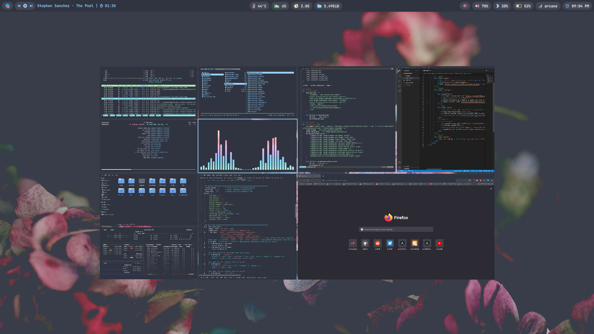](https://youtu.be/dCHtwyD1wzo)

<p align="center">The ultimate NEWM configuration (A Desktop Environment Like Experience)</p>

---

## Overview

[newm](https://github.com/jbuchermn/newm) is a Wayland compositor written with laptops and touchpads in mind. The idea is, instead of placing windows inside the small viewport (that is, the monitor) to arrange them along an arbitrarily large two-dimensional wall (generally without windows overlapping) and focus the compositors job on moving around along this wall efficiently and providing ways to the user to rearrange the wall such that he finds the overall layout intuitive.

- **Operating System** : `Archcraft`
- **Window Manager** : `Newm`
- **Status Bar** : `Waybar`
- **Launcher** : `Wofi`
- **Session Manager** : `Wlogout`
- **Notifications** : `Mako`
- **Terminal** : `Foot`
- **File Manager** : `Thunar`
- **Text Editor** : `Geany`
- **Web Browser** : `Firefox`

## Installation
- **Get the files from** : [Ko-fi :coffee:](https://ko-fi.com/s/524182856f) <sup>[**`Why Paid`**](https://github.com/adi1090x/adi1090x/blob/master/WHY.md)</sup>
- Extract The file **newm.tar.gz** with : `tar -xzvf newm.tar.gz`
- If you are using **`Archcraft`** as your OS, You can just install the provided package with : `sudo pacman -U archcraft-newm-1.0-1-any.pkg.tar.zst`
- If you want to install this setup on _Arch Linux_ or on any _other distro_, follow the points below :
  - Install the following programs on your computer: [`newm`](https://github.com/jbuchermn/newm/#installing), `wtype` `alacritty` `wlroots` `wl-clipboard` `waybar` `wofi` `foot` `mako` `grim` `slurp` `wf-recorder` `light` `yad` `wlogout` `thunar` `geany` `mpv` `mpd` `mpc` `viewnior` `imagemagick` `xfce-polkit` `xorg-xwayland`
  - After installing programs above, Create _newm_ directory in **`~/.config`** : `mkdir -p ~/.config/newm`
  - Copy Everything from _`dotfiles/config`_ to **`~/.config/newm`** : `cp -r ./dotfiles/config/* ~/.config/newm/`
  - To launch `Newm` properly on your system, install the additional files provided in _`shared`_ directory :
  ```
  sudo install -Dm 755 dotfiles/shared/open-wl /usr/local/bin/open-wl
  sudo install -Dm 755 dotfiles/shared/run_newm /usr/local/bin/run_newm
  sudo install -Dm 755 dotfiles/shared/wayland_variables /usr/local/bin/wayland_variables
  sudo install -Dm 755 dotfiles/shared/00-lock.sh /usr/lib/systemd/system-sleep/00-lock.sh
  sudo install -Dm 644 dotfiles/shared/newm.desktop /usr/share/wayland-sessions/newm.desktop
  ```
  - Logout and login to your amazingly configured Newm.

### Appearance

Install the following `theme`, `icon pack`, `cursors` and `fonts` for overall appearance.

- GTK Theme : [Nordic gtk theme](https://www.gnome-look.org/p/1267246/)
- Icon Theme : [Qogir icon theme](https://www.gnome-look.org/p/1296407/)
- Cursor Theme : [Qogir cursor theme](https://www.gnome-look.org/p/1366182/)
- Fonts : [JetBrainsMono Nerd Font](https://github.com/ryanoasis/nerd-fonts/releases/download/v2.1.0/JetBrainsMono.zip), [Iosevka Nerd Font](https://github.com/ryanoasis/nerd-fonts/releases/download/v2.1.0/Iosevka.zip), [Icomoon Feather](https://github.com/archcraft-os/archcraft-packages/blob/main/archcraft-fonts/files/icon-fonts/Icomoon-Feather.ttf), [Archcraft](https://github.com/archcraft-os/archcraft-packages/blob/main/archcraft-fonts/files/icon-fonts/archcraft.ttf)

## Config Structure
```
~/.config
└── newm              : Newm config directory
    ├── foot          : Terminal config
    ├── mako          : Notification daemon config
    │   └── icons     : Notification icons
    ├── scripts       : Various scripts for functionality
    ├── wallpapers    : Wallpapers
    ├── waybar        : Statusbar config
    ├── wlogout       : Wlogout config
    │   └── icons     : Session icons
    ├── wofi          : Launcher config
    └── config.py     : Main config file for NEWM
```

## Keybindings

| Keys | Action |
| --- | --- |
| <kbd>super</kbd> | Toggle Overview |
| <kbd>super + Return</kbd> | Open terminal |
| <kbd>super + shift + Return</kbd> | Open floating terminal |
| <kbd>super + alt + Return</kbd> | Open terminal with selected geometry |
| <kbd>super + F</kbd> | Open file manager |
| <kbd>super + E</kbd> | Open text editor |
| <kbd>super + W</kbd> | Open web browser|
| <kbd>super + D</kbd> | Run app launcher |
| <kbd>super + X</kbd> | Run powermenu |
| <kbd>super + N</kbd> | Open network manager |
| <kbd>super + P</kbd> | Run colorpicker |
| <kbd>super + C/Q</kbd> | Kill active window |
| <kbd>ctrl + alt + L</kbd> | Run lockscreen |
| <kbd>super + shift + C</kbd> | Reload newm config |
| <kbd>ctrl + alt + Delete</kbd> | Exit newm instantly |
| <kbd>super + Space</kbd> | Toggle fullscreen mode |
| <kbd>super + shift + Space</kbd> | Toggle floating mode |
| <kbd>super + S</kbd> | Swap b/w overlapping views |
| <kbd>super + Equal</kbd> | Increase Scale / Zoom in |
| <kbd>super + Minus</kbd> | Decrease Scale / Zoom out |
| <kbd>super + Left</kbd> | Change focus to the left view |
| <kbd>super + Right</kbd> | Change focus to the right view |
| <kbd>super + Up</kbd> | Change focus to the upper view |
| <kbd>super + Down</kbd> | Change focus to the lower view |
| <kbd>super + shift + Left/Right/Up/Down</kbd> | Move view to respective side |
| <kbd>super + ctrl + Left/Right/Up/Down</kbd> | Resize view respectively |

## Touchpad Gestures

| Move <kbd>super + move-1</kbd> | Resize <kbd>super + swipe-2</kbd> | Scroll <kbd>swipe-3</kbd> | Scale <kbd>swipe-4</kbd> |
| --- | --- | --- | --- |
|[](https://youtu.be/SypOVo2SnCA)|[](https://youtu.be/mWkmvKaVpjU)|[](https://youtu.be/z7S3L-RZskY)|[](https://youtu.be/GsQnzC1vNR8)|

## Tour : Videos

**Here's the [Complete Youtube Playlist](https://youtube.com/playlist?list=PLXH9dADRlWHaXM3Q8G_gaunljITif3cUl)** demonstrating features.

| Random wallpapers | Rounded corners | Blur effect | Smooth animations | Lockscreen |
| --- | --- | --- | --- | --- |
|[](https://youtu.be/Ux2xydTS_Tk)|[](https://youtu.be/nLO2tw2mq3A)|[](https://youtu.be/uCM2AxVOAu8)|[](https://youtu.be/DY6ydAk5i8o)|[](https://youtu.be/wwLWY149k20)|

| Overview | Moving | Resizing | Scrolling | Scaling |
| --- | --- | --- | --- | --- |
|[](https://youtu.be/s96UX_6sVUY)|[](https://youtu.be/SypOVo2SnCA)|[](https://youtu.be/mWkmvKaVpjU)|[](https://youtu.be/z7S3L-RZskY)|[](https://youtu.be/GsQnzC1vNR8)|

## Screenshots

**`Solid`**
| Desktop | Tiles | Wofi |
| --- | --- | --- |
|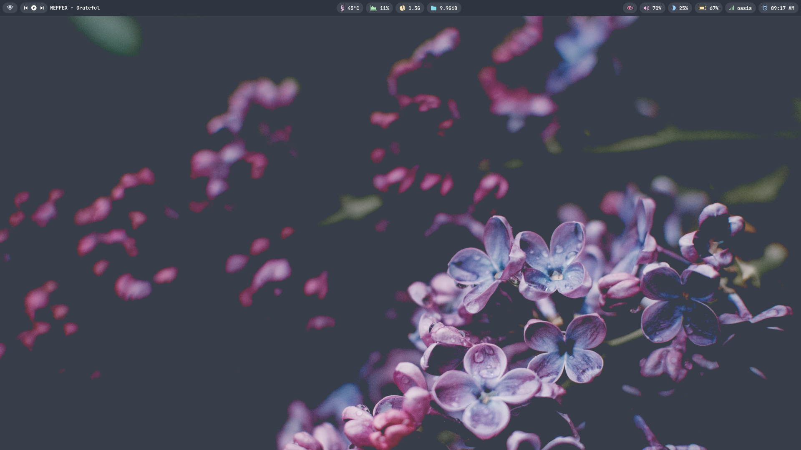|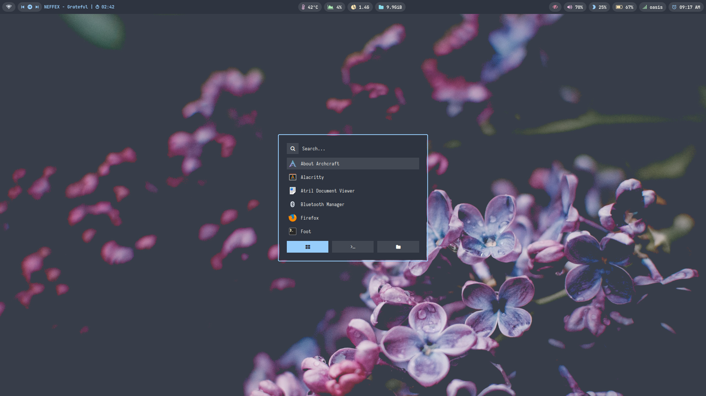|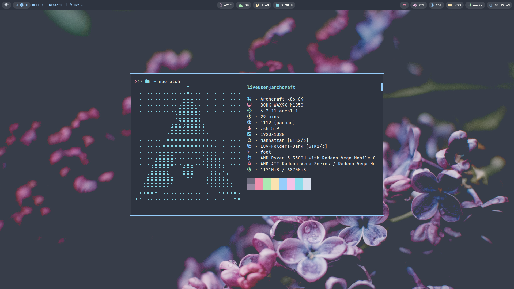|

| Lockscreen | Overview | Wlogout |
| --- | --- | --- |
|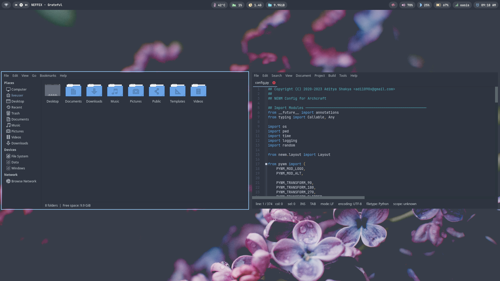||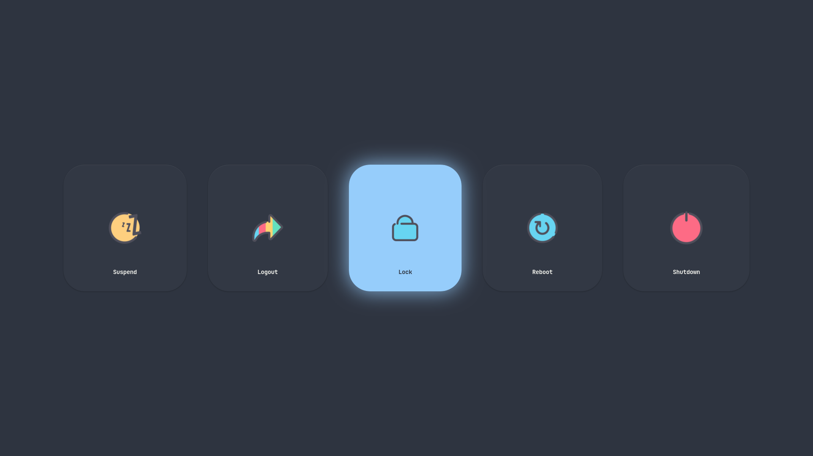|

**`Blur`**
| Desktop | Tiles | Wofi |
| --- | --- | --- |
|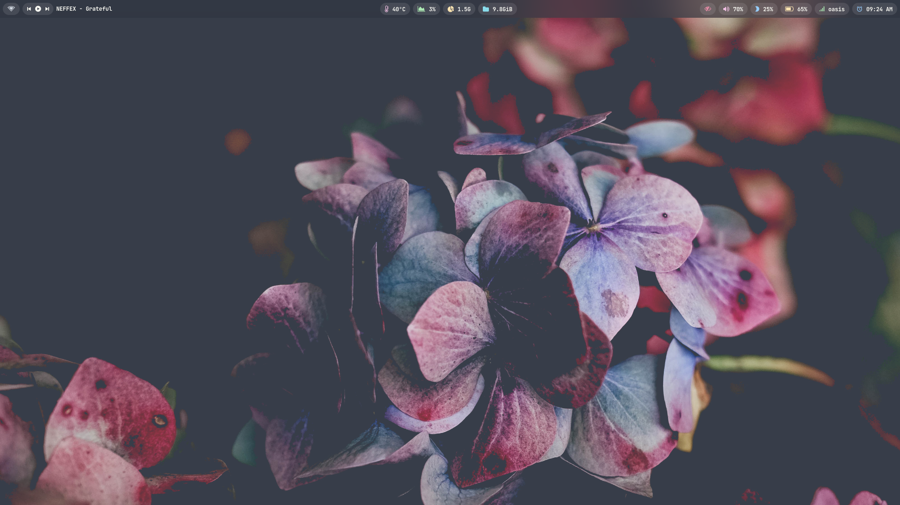|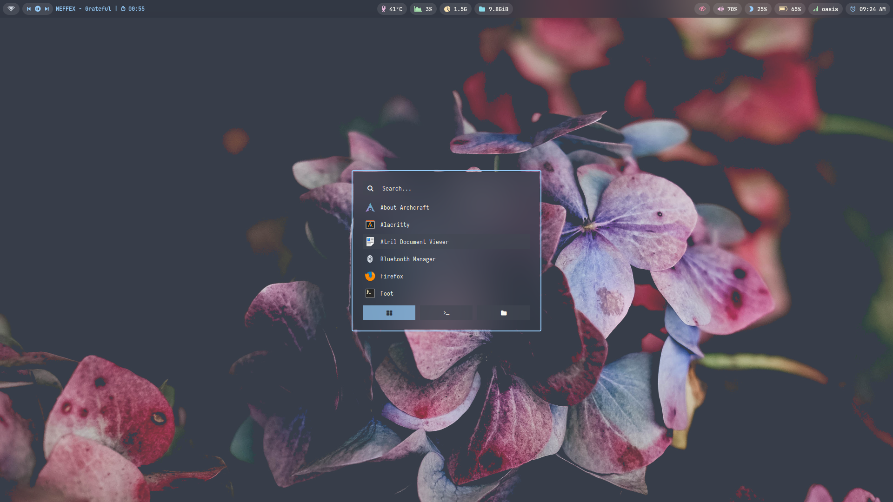|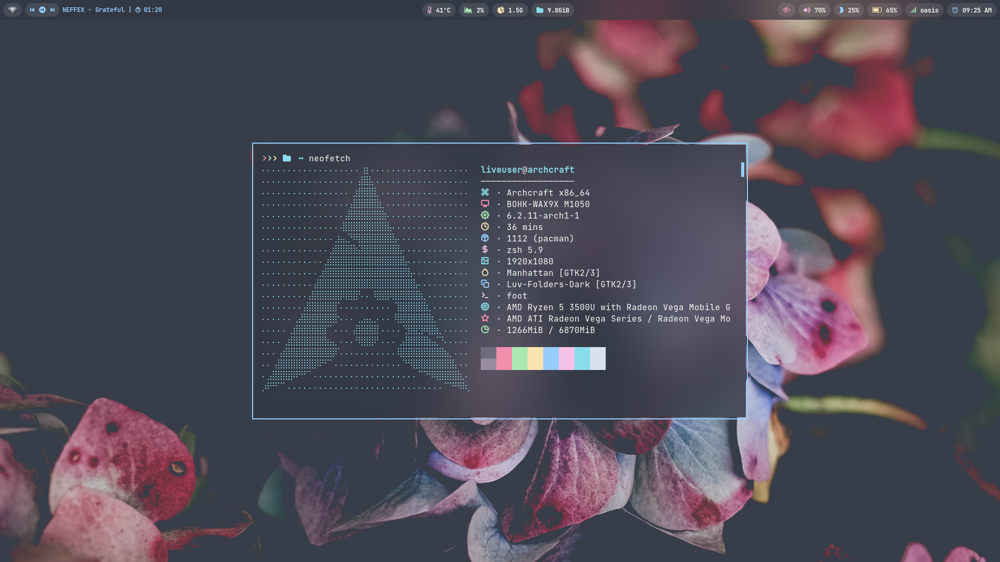|

| Lockscreen | Overview | Wlogout |
| --- | --- | --- |
|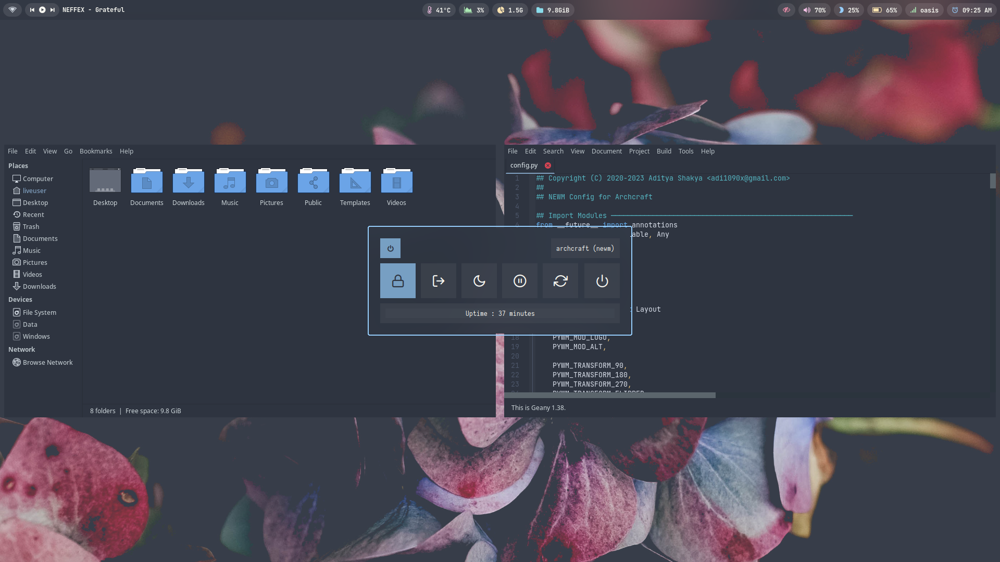|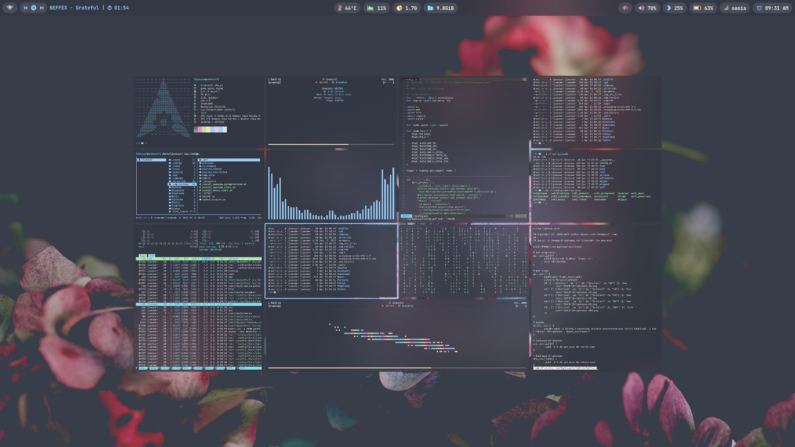|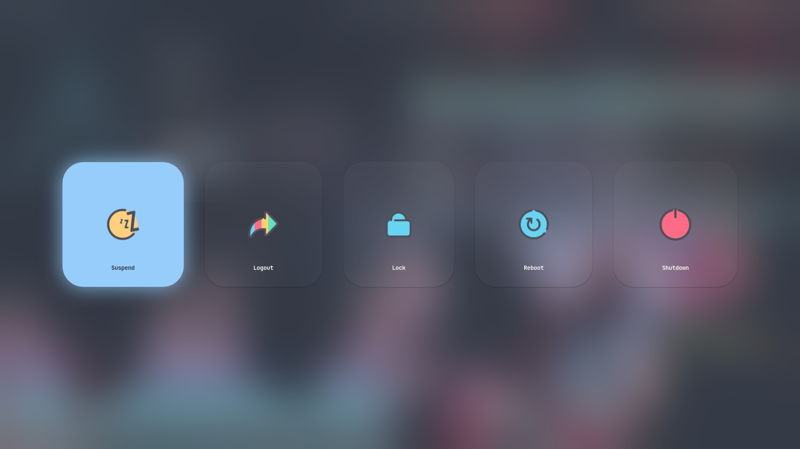|

## FYI
- May or may not work on [**`Nvidia`**](https://wiki.archlinux.org/title/Sway#Installation), See [wayland requirements](https://wiki.archlinux.org/title/wayland#Requirements).
- Thank you for your support.

---

### See Also

| [**`archcraft-sway`**](https://github.com/archcraft-os/archcraft-sway) | [**`archcraft-wayfire`**](https://github.com/archcraft-os/archcraft-wayfire) | [**`archcraft-river`**](https://github.com/archcraft-os/archcraft-river) | [**`archcraft-hyprland`**](https://github.com/archcraft-os/archcraft-hyprland) |
| --- | --- | --- | --- |
|[](https://github.com/archcraft-os/archcraft-sway)|[](https://github.com/archcraft-os/archcraft-wayfire)|[](https://github.com/archcraft-os/archcraft-river)|[](https://github.com/archcraft-os/archcraft-hyprland)|
